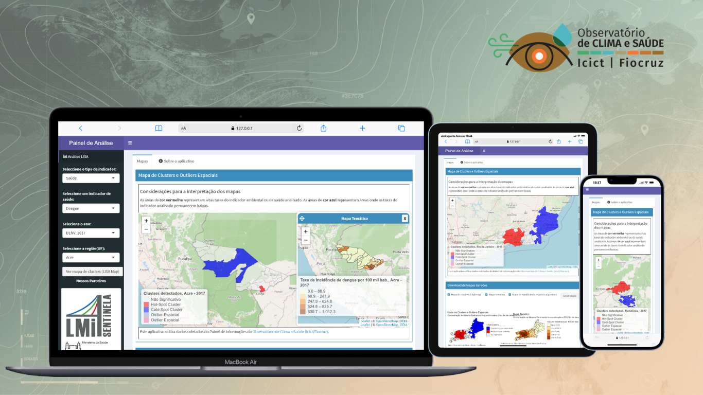

# ClusterMap Brasil | OCS/ICICT/Fiocruz

Plataforma web que permite explorar, por meio de mapas interativos, clusters espaciais e áreas de maior risco (hotspots) relacionadas a indicadores de clima e saúde no Brasil. 

<p align="center">
  
</p>

---

## 📁 Estrutura do Projeto

```
painel_estacoes/
├── app.R                   # Arquivo principal da plataforma, responsável por definir a interface do usuário e a lógica do servidor
├── data/
│   └── db_indx.sqlite    # Banco de dados reduzido para testes locais (não utilizado em produção) 
├── www/
    └── partners.jpg       # Logos, ícones, etc.
```
---

## ⚙️ Requisitos

- **R** ≥ 4.2
- **RStudio** 
- Pacotes R (instalados automaticamente via `setup.R`):
  - `shiny`, `shinydashboard`, `RSQLite`
  - `DBI`, `leaflet`, `ggplot2`
  - `dplyr`, `base64enc`, `RColorBrewer`
  - `sf`, `rgeoda`, `classInt`
  - `shinyWidgets`, `shinyjqui`, `shinyjs`

---

## ▶️ Como Executar

### 1. Baixar e descompactar o banco de dados

Baixe o projeto manualmente em: https://github.com/mairamorenoc/health-clusters

### 2. Iniciar o app localmente

```r
shiny::runApp()
```

Ou clique em **Run App** no RStudio.

---

## 📂 Abas da plataforma

| Aba | Descrição |
|-----|-----------|
| **Mapas** | Mapas interativos que mostram os clusters e as áreas geográficas com maior risco para o indicador analisado |
| **Sobre a plataforma** | Informações sobre a fonte e tratamento dos dados, metodologia estatística, entre outros |

---

## 🔄 Fluxo de Dados

A plataforma utiliza dados coletados do [Painel de Informações do Observatório de Clima e Saúde (Icict/Fiocruz)](https://climaesaude.icict.fiocruz.br).

---

## 🧱 Arquitetura do Projeto

### Dashboard (Frontend)
- Desenvolvido em **R Shiny**
- Responsável pela interface do usuário, pela reatividade e pelas visualizações de dados.

---

## 📊 Metodologia Estatística

A identificação de clusters espaciais é realizada com base no Indicador Local de Autocorrelação Espacial (Anselin, 1995), conhecido como **estatística LISA**. Essa abordagem permite identificar agrupamentos de municípios contíguos que apresentam padrões estatisticamente semelhantes em relação aos indicadores de clima e saúde analisados, evidenciando áreas com maior ou menor concentração de risco.

---

## 👨‍💻 Equipe de Desenvolvimento

### Dashboard (Frontend - R Shiny)
- **Maira Alejandra Moreno**  
  [](https://github.com/mairamorenoc)  

---

## 📬 Contato
  
- [maira.moreno@fiocruz.br](mailto:maira.moreno@fiocruz.br)